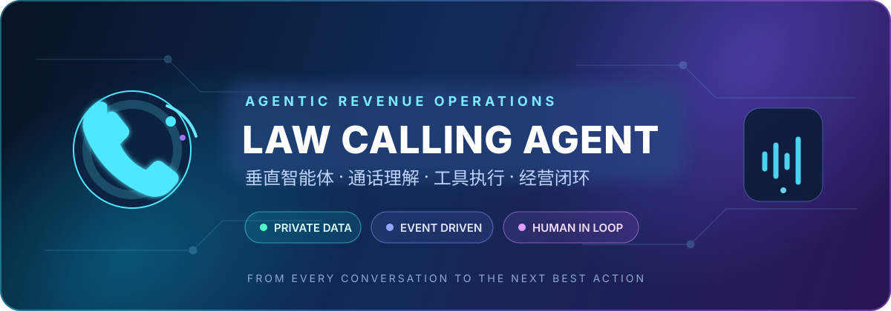
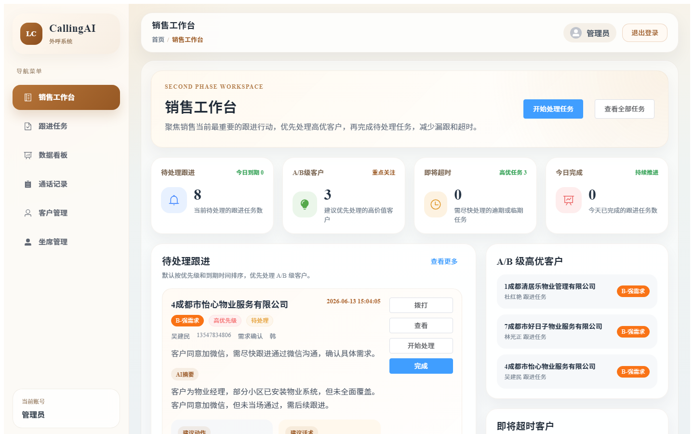
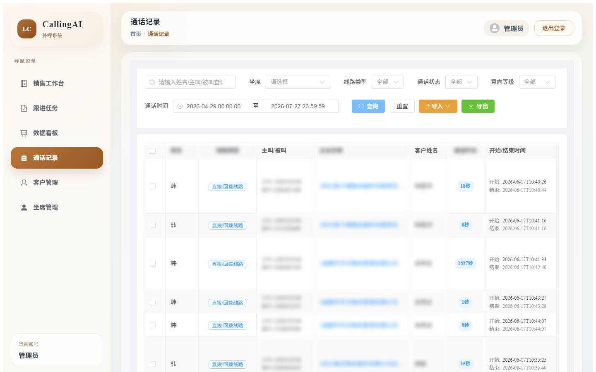
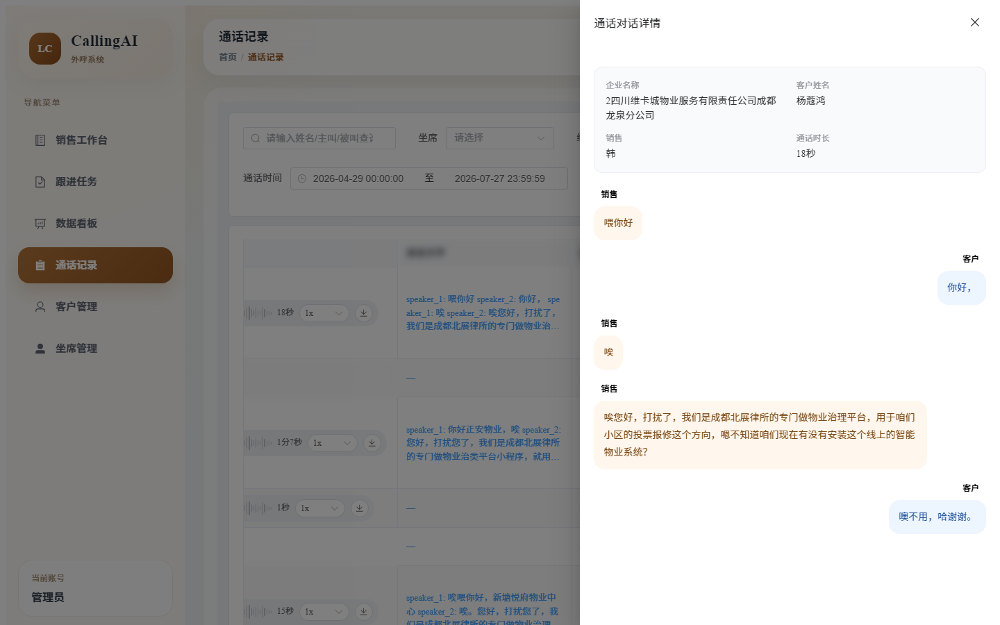
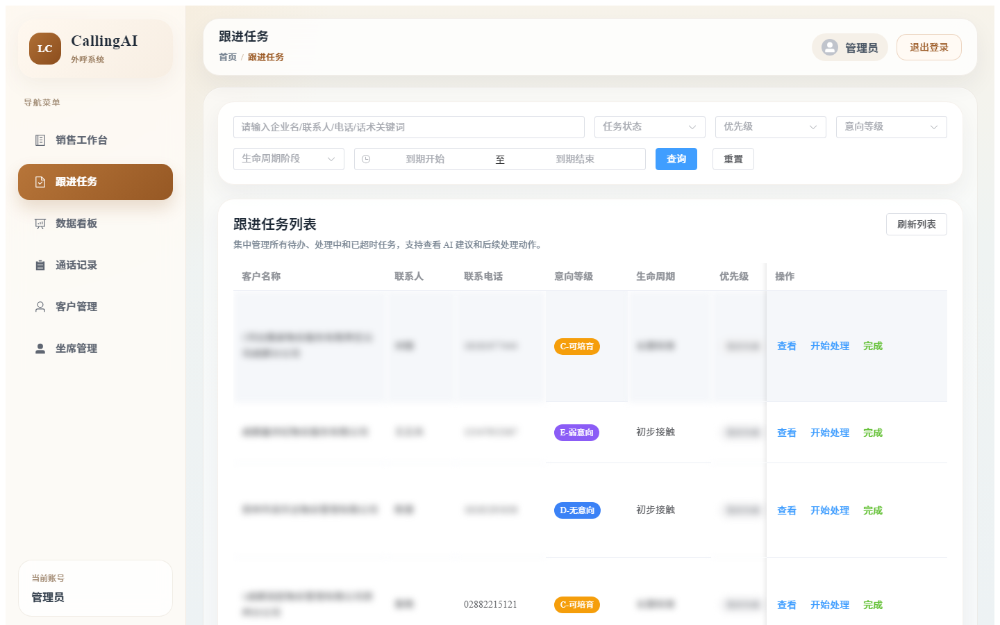
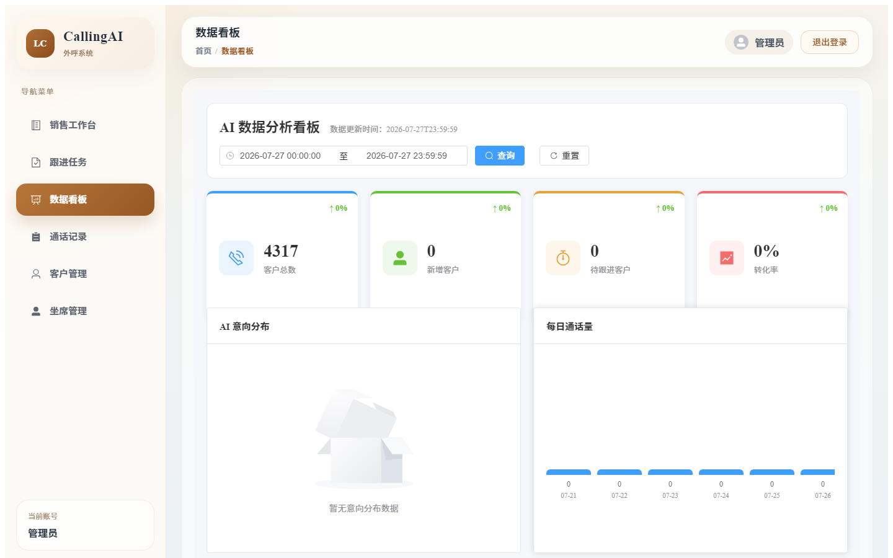

<p align="center">
  
</p>

<h1 align="center">Law Calling Agent</h1>

<p align="center">
  <strong>智能外呼分析与销售跟进平台</strong><br/>
  <sub>面向法律服务、商标与企业服务销售场景的 Agent 化销售工作流与企业增长智能平台</sub>
</p>

<p align="center">
  以客户通话为触发器，通过 ASR、LLM、事件驱动架构和确定性业务规则，<br/>
  将非结构化沟通转化为结构化洞察、Next Best Action、销售跟进任务和客户经营记录。
</p>

<p align="center">
  
  
  
  
  
</p>

<p align="center">
  
  
  
  
  
  
</p>

<p align="center">
  <a href="#真实系统界面">系统截图</a> ·
  <a href="#项目定位">项目定位</a> ·
  <a href="#垂直业务-agent">垂直 Agent</a> ·
  <a href="#核心业务闭环">业务闭环</a> ·
  <a href="#系统架构">系统架构</a> ·
  <a href="#当前能力与完成度">能力矩阵</a> ·
  <a href="#本地开发">快速开始</a> ·
  <a href="#演进路线">演进路线</a>
</p>

---

## 真实系统界面

> 以下截图来源于实际部署和试运行的业务系统，客户姓名、联系电话、企业名称、录音信息、通话内容和销售数据均已脱敏或替换。

<!-- 截图待补充：请从 http://falvabc.net 登录后截取以下页面，对敏感信息打码后放入 docs/assets/screenshots/ -->

<table>
  <tr>
    <td width="50%" align="center">
      <strong>销售工作台</strong><br/>
      <sub>聚合待办、高意向客户、即将超时任务和今日完成</sub><br/><br/>
      
    </td>
    <td width="50%" align="center">
      <strong>通话记录</strong><br/>
      <sub>话单列表、录音播放、通话状态与筛选</sub><br/><br/>
      
    </td>
  </tr>
  <tr>
    <td width="50%" align="center">
      <strong>ASR 转写与 AI 对话</strong><br/>
      <sub>语音转文字、角色分离、意向等级与 AI 评价</sub><br/><br/>
      
    </td>
    <td width="50%" align="center">
      <strong>通话对话详情</strong><br/>
      <sub>完整对话流、销售与客户角色气泡</sub><br/><br/>
      
    </td>
  </tr>
  <tr>
    <td width="50%" align="center">
      <strong>跟进任务</strong><br/>
      <sub>AI 自动生成、优先级排序、建议话术与状态流转</sub><br/><br/>
      
    </td>
    <td width="50%" align="center">
      <strong>数据看板</strong><br/>
      <sub>客户统计、通话趋势、意向分布与转化指标</sub><br/><br/>
      
    </td>
  </tr>
</table>

---

## ✨ 从录音归档，到 Agentic Revenue Operations

Law Calling Agent（仓库工程名 `law-calling-assistant`）最初用于解决第三方外呼 SaaS **录音保存周期短、业务数据不私有、销售复盘依赖人工** 等问题。项目现已从"话单导入 + 录音自动下载 + AI 分析"逐步演进为由管理端、业务后端和智能服务构成的 Agentic Revenue Operations Platform。

<table>
  <tr>
    <td width="33%" valign="top">
      <h3>🔐 数据主权</h3>
      <p>通话、录音、转写与客户数据私有化沉淀，形成企业自己的销售数据底座。</p>
    </td>
    <td width="33%" valign="top">
      <h3>🧠 通话理解</h3>
      <p>ASR + LLM 将非结构化语音转化为摘要、痛点、意向、风险与下一步建议。</p>
    </td>
    <td width="33%" valign="top">
      <h3>⚡ 行动闭环</h3>
      <p>AI 洞察进入确定性任务状态机，驱动销售处理、客户回写与经营度量。</p>
    </td>
  </tr>
</table>

项目的长期目标不是简单替代一个录音分析工具，而是构建：

<p align="center">
  <strong>自有通信外呼平台&nbsp;&nbsp;×&nbsp;&nbsp;垂直业务 Agent&nbsp;&nbsp;×&nbsp;&nbsp;ERP 经营智能平台</strong>
</p>

---

## 📋 真实业务背景与运行情况

| 维度 | 说明 |
|------|------|
| 开发时间 | 2026 年 5 月至 6 月 |
| 部署环境 | 曾部署至公司正式服务器，接入真实外呼平台 |
| 服务规模 | 服务 2 名销售人员 |
| 日常话单 | 团队每天产生约 100～200 通电话录音 |
| 累计数据 | 试运行期间累计导入数百条话单，数据库已保存完整全链路数据 |
| 当前状态 | 开发者转去负责其他业务项目，当前暂停迭代 |
| 源码说明 | 项目源码因业务保密保持私有；公开仓库展示架构、业务闭环与工程设计 |

> 项目定位为 **Production Pilot**：已在真实业务环境中完成核心链路验证，非练习案例或 Demo 项目。

---

## 🎯 项目定位

当前项目已经完成 **销售跟进 Agent MVP** 的核心业务闭环，并正在向 **法律服务销售垂直 Agent** 演进。

**当前已实现**：模型输出结构化跟进建议，Java 业务规则根据建议触发任务生成和客户状态更新。

**下一阶段**：动态计划生成、工具注册与选择、Agent Runtime、长期记忆和评测体系。

平台面向三个核心角色：

- **销售人员**：集中查看待办、高意向客户、建议动作与参考话术，减少通话后的信息遗漏。
- **主管与运营**：跟踪外呼质量、任务处理、客户阶段与团队执行效率。
- **管理层**：从客户生命周期、转化漏斗、销售画像和经营指标理解业务运行状态。

---

## 📊 三层能力模型

本项目的能力按照 **CURRENT / NEXT / VISION** 三层划分，明确区分已实现、下一阶段和长期蓝图。

### CURRENT｜真实运行能力

> 以下能力已在真实业务环境中完成验证，数据库中保存完整的全链路业务数据。

- 接入第三方真实外呼平台的话单、录音和坐席数据
- Webhook 实时回调与定时拉取双通道话单导入
- 销售与坐席自动匹配
- 录音文件私有化归档到服务器本地存储
- 讯飞 ASR 语音转写（说话人分离、限流重试、多格式响应解析）
- DeepSeek LLM 结构化分析（意向分级 A-G、跟进等级 A-D、痛点、标签、建议话术）
- 两阶段异步 AI Pipeline（RabbitMQ 4 队列拓扑）
- 结构化 Next Best Action 输出
- AI 分析结果落库
- 跟进任务自动生成（意向→优先级→到期时间映射、任务抑制与去重）
- 销售工作台（待办、高意向、超时、今日完成）
- 任务人工处理（开始、完成、延期、取消）
- 客户状态自动回写（意向等级、生命周期阶段、下次跟进时间）
- 客户跟进记录自动生成
- Vue 3 + Spring Boot + FastAPI 三端协作

### NEXT｜下一阶段工程增强

- RabbitMQ 死信队列（DLQ）、延迟重试、消息 Inbox/Outbox
- 消费幂等、统一状态机、自动补偿
- 统一客户上下文聚合接口（Customer Context Builder）
- Agent Tool 封装（带 Schema、权限和副作用说明）
- AgentRun / Step / ToolCall 运行轨迹
- Human Approval 审批中心
- Agent Eval 评估体系
- 企业 RAG（产品知识、销售话术、异议案例）

### VISION｜企业产品蓝图

> 以下内容为基于现有客户、通话、分析和任务底座设计的企业演进蓝图，不代表当前版本已经全部实现。

- **自有通信外呼平台**：SIP、线路、号码、坐席、呼叫策略、实时状态、录音与计费
- **ERP 经营集成**：组织、人员、客户、合同、订单、回款、结算与成本，形成 Call to Cash 经营链路
- **Enterprise Agent**：RAG、受控智能执行、销售教练、通话质检、成交预测、管理者 Copilot
- **企业增长智能中枢**：触达→理解→执行→成交→复盘的全链路增长基础设施

---

## 🔥 核心产品能力

<table>
  <tr>
    <td width="33%" valign="top">
      <h3>📇 Customer 360</h3>
      <p>统一客户主档、销售归属、联系历史、意向等级、生命周期和跟进时间线。</p>
    </td>
    <td width="33%" valign="top">
      <h3>🎙️ Conversation Intelligence</h3>
      <p>自动归档录音，通过 ASR + LLM 提取摘要、痛点、标签、意向和风险信号。</p>
    </td>
    <td width="33%" valign="top">
      <h3>🤖 Structured NBA</h3>
      <p>综合客户上下文输出意向分级、跟进等级、建议动作、推荐时间和参考话术。</p>
    </td>
  </tr>
  <tr>
    <td width="33%" valign="top">
      <h3>✅ Follow-up Orchestration</h3>
      <p>将 AI 建议转化为可分配、可延期、可取消、可完成、可审计的业务任务。</p>
    </td>
    <td width="33%" valign="top">
      <h3>🧑‍💻 Agent Cockpit</h3>
      <p>聚合上下文、AI 证据、行动计划、今日待办和执行结果，让销售围绕目标而非页面工作。</p>
    </td>
    <td width="33%" valign="top">
      <h3>📊 Revenue Operations</h3>
      <p>把通话、客户、任务和销售行为汇总为可观测指标，为主管和管理层提供经营视角。</p>
    </td>
  </tr>
</table>

<a id="垂直业务-agent"></a>

## 🤖 销售跟进 Agent MVP

Law Calling Agent 不是在 CRM 页面旁边增加一个聊天框，而是让智能体进入真实销售流程：当前版本由模型输出结构化跟进建议，Java 业务规则根据建议触发任务生成和客户状态更新；动态计划和工具选择属于下一阶段 Agent Runtime。

> **An agentic revenue operations platform that transforms customer conversations into governed, executable sales actions.**

<table>
  <tr>
    <td width="25%" valign="top">
      <h3>01 · Observe</h3>
      <p><strong>感知业务现场</strong></p>
      <p>读取客户档案、历史通话、录音转写、跟进记录和当前任务，形成完整上下文。<br/><sub>✅ CURRENT</sub></p>
    </td>
    <td width="25%" valign="top">
      <h3>02 · Reason</h3>
      <p><strong>理解与规划</strong></p>
      <p>判断客户阶段、成交机会、核心异议和风险信号，生成结构化 Next Best Action。<br/><sub>✅ CURRENT</sub></p>
    </td>
    <td width="25%" valign="top">
      <h3>03 · Act</h3>
      <p><strong>确定性执行</strong></p>
      <p>Java 规则自动创建任务、更新客户状态，高风险动作提交人工审批。<br/><sub>✅ CURRENT</sub></p>
    </td>
    <td width="25%" valign="top">
      <h3>04 · Learn</h3>
      <p><strong>从结果中优化</strong></p>
      <p>记录建议是否被采纳、任务是否完成及客户是否转化，反哺策略和评估体系。<br/><sub>🧭 NEXT</sub></p>
    </td>
  </tr>
</table>

### Agent 的业务输出

垂直 Agent 的输出不是一段泛化回答，而是一份带依据、风险和执行边界的结构化计划：

```text
客户上下文 → ASR 转写 → LLM 结构化分析 → Next Best Action → Java 规则引擎 → 任务生成 → 人工处理 → 客户回写
```

**当前模型拥有建议输出能力，Java 业务系统保留任务生成、状态迁移和最终写入权；动态工具选择属于 Roadmap。**

Agent 可使用的能力将按照副作用分级：**Context Tools** 负责读取客户与通话，**Knowledge Tools** 负责检索产品和话术知识，**Action Tools** 负责创建任务与更新状态，**Governance Tools** 负责审批、审计和终止执行。当前这些能力以 REST API 形式存在，下一阶段将封装为 Agent Tool。

<a id="核心业务闭环"></a>

## 🔄 核心业务闭环

<table>
  <tr align="center">
    <td width="22%"><strong>01 · 数据沉淀</strong><br/><sub>客户、通话与录音</sub></td>
    <td width="4%">→</td>
    <td width="22%"><strong>02 · AI 理解</strong><br/><sub>转写、意向与建议</sub></td>
    <td width="4%">→</td>
    <td width="22%"><strong>03 · 规则执行</strong><br/><sub>任务、状态与回写</sub></td>
    <td width="4%">→</td>
    <td width="22%"><strong>04 · 经营反馈</strong><br/><sub>跟进、转化与洞察</sub></td>
  </tr>
</table>

整个闭环采用"**AI 认知理解 + 业务确定执行**"双层控制：智能层理解通话、组织客户上下文并提出下一最佳动作；Java 业务内核根据有效性、等级、时间和去重规则决定动作能否执行。当前模型拥有建议输出能力，业务系统始终保留最终写入权。

<a id="系统架构"></a>

## 🏗️ 系统架构

项目采用前后端分离、智能服务解耦与事件驱动架构，将用户体验、AI 认知分析和确定性业务执行划分为可独立演进的能力层。

> **Experience Layer** 呈现通话洞察、AI 建议和任务工作台；**Intelligence Service** 承载音频处理、ASR 和 LLM 结构化分析；**Action Gateway** 负责权限、事务和状态一致性；**Data Layer** 沉淀业务事实。

### 服务职责

| 子项目 | 核心职责 | 主要技术 |
| --- | --- | --- |
| `law-calling-admin` | **Agent Cockpit**：客户上下文、通话洞察、行动计划、任务工作台以及未来的审批与执行轨迹 | Vue 3、TypeScript、Vite、Element Plus、Vue Router、Axios、Less |
| `law-calling-api/LawCallingAI` | **Domain Kernel & Action Gateway**：业务规则、任务状态机、录音归档、AI 调度、客户状态回写 | Java 17、Spring Boot、Spring Data JPA、MySQL、Redis、RabbitMQ、EasyExcel |
| `law-calling-ai-service/ai_microservice` | **Intelligence Service**：音频处理、ASR 转写、LLM 结构化分析，并作为后续 Agent Runtime 的演进基础 | Python、FastAPI、Pydantic、aio-pika、HTTPX、pydub |

## 💡 为什么它是 Agent 化销售工作流，而不是聊天机器人

通用聊天机器人回答问题，Agent 化销售工作流则需要围绕业务目标持续感知、规划和执行。本项目跨越音频处理、模型推理、消息驱动、事务数据和人工操作五类边界，重点解决以下工程问题：

| 工程问题 | 设计方案 | 架构价值 |
| --- | --- | --- |
| ASR/LLM 调用耗时长且可能失败 | RabbitMQ 两阶段异步编排，同时保留 HTTP 分析与补偿入口 | 解耦核心业务请求与长耗时推理，支持失败重试和人工补偿 |
| 模型输出具有不确定性 | Pydantic 响应模型 + Java DTO 双层契约，对等级、时间和字段进行归一化 | 防止自由文本直接污染业务库，稳定跨语言服务边界 |
| "AI 建议"不等于"业务动作" | 模型负责意向与建议，Java 规则负责有效性、去重、优先级和建单条件 | 将概率推理与确定性规则分离，保证业务可解释、可审计 |
| 多阶段处理容易产生部分成功 | 分析状态、错误原因、结果监听、持久化服务与补偿接口分层 | 能够定位任务停在哪一阶段，降低异步链路排障成本 |
| 跟进任务与客户历史语义不同 | `AiFollowTask` 与 `CustomerFollowRecord` 分离建模 | 同时支持未来待办状态机和已发生事实时间线 |
| 音频来源和部署环境不一致 | 支持远程录音 URL、本地路径、转写文本和结构化对话多种输入 | 兼容本地、服务器和历史数据补跑场景 |

### Agent 工程化设计

| Agent 能力 | 当前状态 | 设计定位 |
| --- | --- | --- |
| **Context** | ✅ 数据已存在，分散在各 Service | 🧭 NEXT：统一客户上下文聚合接口 |
| **Planning** | ✅ 由 LLM 一次性输出结构化 NBA | 🧭 NEXT：动态多步计划生成 |
| **Memory** | ✅ 客户、通话、分析和跟进数据沉淀在数据库 | 🧭 NEXT：长期摘要、向量检索和跨会话记忆 |
| **Tools** | ✅ 11 个 Controller / 33+ 个 REST API 已具备 | 🧭 NEXT：封装为 Agent Tool（带 Schema、权限和副作用说明） |
| **Governance** | ✅ Human-in-the-Loop 任务生命周期 | 🧭 NEXT：Agent Approval 与 Tool Call Audit |
| **Evaluation** | ❌ 尚未实现 | 🧭 NEXT：结构有效率、建议采纳率、任务完成率与转化反馈 |

### 关键设计原则

- **Event-driven first**：分析任务和结果通过消息队列解耦，降低服务间时序耦合。
- **Contract before prompt**：先定义结构化响应契约，再约束 Prompt 与解析逻辑，避免下游依赖自然语言猜测。
- **AI proposes, business disposes**：AI 提供判断和建议，业务后端掌握最终状态迁移与数据写入权。
- **Human in the loop**：关键跟进动作保留人工确认、调整、延期和取消能力，避免自动化越权。
- **Memory with provenance**：客户记忆必须能够追溯到通话、记录或业务事实，不能让模型生成无法验证的"记忆"。
- **Tools with guardrails**：每个 Agent Tool 都应声明输入契约、权限范围、副作用和审批策略。
- **Evolutionary architecture**：通信、ASR、LLM、业务规则与前端体验保持清晰边界，为后续供应商替换和 ERP/RAG 扩展预留空间。

<a id="当前能力与完成度"></a>

## 🧭 当前能力与完成度

> "已实现"表示仓库中已有对应页面、接口或核心实现；生产可用性仍应以真实环境的联调、测试和验收结果为准。

| 能力域 | 当前状态 | 说明 |
| --- | --- | --- |
| 真实外呼数据接入 | ✅ 已实现 | 接入第三方外呼平台话单、录音和坐席数据 |
| 客户管理 | ✅ 已实现 | 客户增删改查、批量导入导出、负责人/来源/阶段维护、跟进记录关联 |
| 通话记录 | ✅ 已实现 | 话单导入、动态坐席匹配、查询筛选、导出、去重、录音访问与补偿分析 |
| 录音归档 | ✅ 已实现 | 从外部来源获取录音并落入私有存储，支持在线播放 |
| ASR 转写 | ✅ 已实现 | 讯飞 REST ASR、说话人分离、限流重试、多格式响应解析 |
| LLM 结构化分析 | ✅ 已实现 | DeepSeek LLM JSON Mode、268 行系统提示词、输出截断自动补救 |
| 结构化 Next Best Action | ✅ 已实现 | 意向等级 A-G、跟进等级 A-D、建议动作、推荐时间、推荐话术、判断理由 |
| 两阶段 AI Pipeline | ✅ 已实现 | RabbitMQ 4 队列拓扑、Stage 1 初步分级 + Stage 2 深度跟进分析 |
| 自动跟进任务 | ✅ 已实现 | 分析结果落库、规则判定、意向→优先级映射、任务生成与去重 |
| 任务处理状态机 | ✅ 已实现 | 查询、详情、开始、完成、延期、取消及客户状态回写 |
| 销售工作台 | ✅ 已实现 | 聚合待办、高优先级、即将超时和最近完成等工作视图 |
| 管理看板 | 🟡 基础实现 | 外呼、接通、有效通话、AI 分析和客户转化等指标仍在扩充 |
| AI 跟进分析 V2 | 🟡 持续调优 | 输出意向等级、跟进等级、建议动作、下次跟进时间、生命周期和参考话术 |
| 自有外呼通信平台 | 🌌 VISION | 面向 SIP/线路、号码、坐席、呼叫策略、实时状态、录音与计费的一体化自有通信能力 |
| Agent Runtime | 🧭 NEXT | AgentRun / Step / ToolCall、动态计划、工具选择与执行轨迹 |
| 长期 Memory | 🧭 NEXT | 客户长期摘要、向量检索、跨会话记忆 |
| RAG | 🧭 NEXT | 产品知识库、销售话术、异议案例和可追溯引用 |
| Agent Eval | 🧭 NEXT | 结构有效率、建议采纳率、任务完成率与最终转化反馈 |
| ERP 经营集成 | 🌌 VISION | 打通组织、人员、客户、合同、订单、回款、结算与成本，形成 Call to Cash 经营链路 |

## 🌐 产品蓝图：企业增长智能中枢

> 以下内容为基于现有客户、通话、分析和任务底座设计的企业演进蓝图，不代表当前版本已经全部实现。

当前能力只是起点。Law Calling Agent 的目标形态，是在统一客户与通话数据之上继续连接通信资源、经营系统和企业智能体，形成覆盖"触达—理解—执行—成交—复盘"的增长基础设施。

<table>
  <tr>
    <td width="33%" valign="top">
      <p><strong>📡 Communication Cloud</strong><br/><sub>🌌 VISION · 自有智能通信平台</sub></p>
      <p>统一管理 SIP/线路、号码、坐席、呼叫策略、实时状态、录音与计费，让通信能力从外部工具升级为企业可编排的基础设施。</p>
      <p><strong>目标效果：</strong>摆脱单一外呼 SaaS 依赖，并把通话质量、线路成本和 AI 分析纳入同一数据闭环。</p>
    </td>
    <td width="33%" valign="top">
      <p><strong>🏢 Revenue Operations</strong><br/><sub>🌌 VISION · ERP 经营数据融合</sub></p>
      <p>连接组织、人员、客户、合同、订单、回款、结算与成本，使每次销售动作都能够追溯到最终经营结果。</p>
      <p><strong>目标效果：</strong>形成从 Call 到 Cash 的完整链路，让管理层看见获客效率、团队产能、收入贡献与成本结构。</p>
    </td>
    <td width="33%" valign="top">
      <p><strong>🧠 Enterprise Agent</strong><br/><sub>🧭 NEXT · RAG 与受控智能执行</sub></p>
      <p>融合企业知识库、经营语义层、质检模型、风险识别与工具调用，为销售和管理层提供上下文感知的决策助手。</p>
      <p><strong>目标效果：</strong>从"回答发生了什么"升级到"解释为什么、建议下一步"，并在权限、审批和审计约束下执行低风险动作。</p>
    </td>
  </tr>
</table>

```text
线索进入 → 智能触达 → 通话理解 → 销售跟进 → 合同订单 → 回款结算
   ↑                                                        ↓
   └──────── 企业知识、经营指标与 AI 决策持续反馈 ────────────┘
```

## 📈 可度量的业务价值

平台不以"调用了多少 AI 接口"作为价值标准，而是关注 AI 是否真正改变了销售流程。当前数据模型与业务链路可进一步支撑以下指标：

| 价值维度 | 系统机制 | 可观测指标 |
| --- | --- | --- |
| 数据资产化 | 录音私有归档、转写与结构化分析 | 录音归档率、分析完成率、历史数据可追溯率 |
| 销售执行力 | AI 建议转任务、工作台统一待办 | 跟进及时率、任务完成率、超时率、平均处理时长 |
| 客户经营 | 意向分级、生命周期、跟进时间线 | 高意向客户覆盖率、阶段转化率、客户停留时长 |
| 团队管理 | 销售归属、过程指标、聚合看板 | 有效通话率、跟进采纳率、人员与团队趋势 |
| 质量与风险 | 摘要、标签、痛点与后续质检扩展 | 无效通话率、风险命中率、质检问题分布 |

> 这些指标不是 README 中虚构的业务成绩，而是平台完成真实数据积累后可以持续计算、验证和优化的经营目标。

## 🧩 技术深度地图

```text
┌──────────────────────────────────────────────────────────────────┐
│ Experience   Agent Cockpit · 销售工作台 · 审批中心 · 运营看板   │
├──────────────────────────────────────────────────────────────────┤
│ Agent        Context · Planning · Memory · Tools · Evaluation     │
│              (CURRENT: 数据底座 + 结构化NBA) (NEXT: Runtime层)   │
├──────────────────────────────────────────────────────────────────┤
│ Domain       客户域 · 通话域 · 分析域 · 跟进任务状态机           │
├──────────────────────────────────────────────────────────────────┤
│ Intelligence ASR · LLM · Prompt · Schema · Guardrails             │
│              (NEXT: RAG · Memory · Eval)                          │
├──────────────────────────────────────────────────────────────────┤
│ Integration  REST · RabbitMQ · 外呼供应商 · 未来 ERP / MCP       │
├──────────────────────────────────────────────────────────────────┤
│ Data         MySQL · Redis · 私有录音 · 业务事实 · 长期记忆      │
└──────────────────────────────────────────────────────────────────┘
```

项目覆盖的不只是前端页面或单个模型接口，而是一条从外部数据采集、跨语言服务通信、智能推理到核心业务状态迁移的完整链路，并进一步面向 Agent Runtime、工具治理、长期记忆和效果评估演进。

## 📁 目录结构

```text
law-calling-assistant/
├── README.md                         # 项目说明
├── docs/
│   ├── assets/                       # Hero 图片与系统截图
│   ├── showcase/                     # 公开展示文档
│   └── project-summary/              # 项目审计与分析（内部）
├── law-calling-admin/                # Vue 3 管理端
│   ├── src/api/                      # 前端接口封装
│   ├── src/router/                   # 路由与访问入口
│   └── src/views/                    # 工作台、任务、客户、通话、分析、坐席等页面
├── law-calling-api/
│   └── LawCallingAI/                 # Spring Boot 业务后端
│       ├── src/main/java/            # Controller、Service、Repository、任务与 MQ 模块
│       └── src/main/resources/       # 分环境配置
└── law-calling-ai-service/
    └── ai_microservice/              # FastAPI AI 服务
        ├── app/services/             # ASR、LLM 与分析服务
        ├── app/worker/               # RabbitMQ 消费者
        └── app/models/               # 请求/响应数据契约
```

## 🧱 核心领域模型

系统围绕以下业务对象组织数据与流程：

- `Customer`：客户主档、归属销售、意向等级、生命周期与最近/下次跟进时间。
- `CallRecord`：一次通话的号码、坐席、时间、时长、录音地址与归档状态。
- `CallRecordAnalysis`：ASR 文本、摘要、标签、痛点、等级、建议动作、建议话术和分析状态。
- `AiFollowTask`：由 AI 分析触发产生的确定性待办，包含优先级、到期时间和处理状态。
- `CustomerFollowRecord`：销售实际处理结果，是任务完成后沉淀客户经营历史的事实记录。
- `SysSale`：销售/坐席信息，用于话单归属、权限边界和运营统计。

领域上刻意区分"跟进任务"与"跟进记录"：前者描述未来要做什么，后者记录已经发生了什么。

Agent 化阶段将在现有领域模型之上增加 `AgentRun`、`AgentStep`、`AgentToolCall`、`AgentApproval`、`AgentMemory` 与 `AgentEvaluation` 等运行对象，用于记录计划、工具调用、审批、记忆来源和评估结果。

## 🔧 工程可靠性和已知边界

| 维度 | 当前状态 | 已知边界 |
| --- | --- | --- |
| 消息可靠性 | RabbitMQ publisher-confirm + 消息持久化 + 消费重试 | 缺少 DLQ、消息 ID 去重和 Outbox 模式 |
| 数据幂等 | call_record.record_id 唯一索引 + Redis Webhook 去重 | ai_follow_task 缺少数据库级唯一索引 |
| 状态管理 | Java if 条件判断当前状态是否允许转换 | 缺少统一状态机定义 |
| 错误处理 | AI 分析有重试计数和 FAILED 标记 | 缺少定时补偿扫描和手动重试入口 |
| 认证 | 本地 JWT 认证（admin 账号） | 原项目使用外部小程序后端认证，当前已替换为本地方案 |
| 前端操作 | 工作台 start/complete 已接通后端 API | 跟进任务页面弹窗操作部分仍为本地 mock |

## 🔐 隐私与源码说明

- 项目源码因业务保密保持私有；公开仓库展示架构设计、业务闭环和工程能力。
- 不要在代码、README、示例配置、日志、截图或接口样例中提交 API Key、Secret、数据库密码和真实客户数据。
- 截图中所有客户姓名、联系电话、企业名称、录音信息和通话内容均需脱敏处理。

<a id="演进路线"></a>

## 🗺️ 演进路线

1. **~~完成核心业务闭环~~** ✅ AI 结果落库、任务状态机、客户回写、工作台已端到端打通。
2. **交付 Agent Runtime MVP**：完成 AgentRun、上下文构建、结构化计划、跟进工具调用、人工审批和执行轨迹。
3. **建设 Memory 与 RAG**：沉淀客户长期记忆、产品知识、销售话术、异议案例和可追溯引用。
4. **建设真实外呼 V1**：接入线路与号码，完成拨号、状态事件、录音回传、话单入库及 Agent 触达工具。
5. **打通 ERP 经营数据**：统一组织、人员、合同、订单、回款、结算和成本口径，为 Agent 提供可信经营工具。
6. **扩展专业 Agent 能力**：建设销售教练、通话质检、风险识别、客户经营、成交预测和管理者 Copilot。

路线遵循"先形成确定性业务闭环，再构建可审计 Agent，随后扩展记忆、通信与经营工具"的依赖关系。

## 📚 文档索引

- [展示文档](./docs/showcase/) — 架构说明、业务流程与能力边界
- [整体开发功能规划](./law-calling-admin/整体开发功能.md)
- [第二阶段实施方案](./law-calling-admin/dev-docs/phase-2-implementation-plan.md)
- [前端设计说明](./law-calling-admin/design.md)
- [后端项目说明](./law-calling-api/LawCallingAI/README.md)

## 🌌 项目愿景

Law Calling Agent 希望建立的不是一个孤立的拨号页面，也不是一个只能回答问题的聊天机器人，而是一套连接"客户触达、通话理解、智能决策、工具执行与经营结果"的垂直业务 Agent 基础设施：

> 让 Agent 听懂每一次通话、记住每一段客户关系、解释每一个行动建议，并在企业规则约束下推动下一最佳动作。
